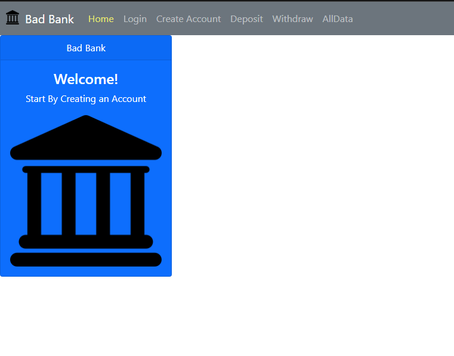

# Bad Bank App

This app is a working model of a functional banking app that could be utilized to create an account that stores a balance of fake currency. The site allows a user to create their account, login, deposit or withdraw "money", and logout.   

## Installation:

1. Create a new folder *{projectFolderName}* 
2. Clone BadBank, copying the url and using **git clone** *{project url}*  
3. Next, **cd** *{projectFolderName}*  to move to the project's folder.
4. Run **npm install** to install it's dependencies. 
5. After that, **npm start** should start the application for you.

Once started the home screen should look like this: 

 

## Tech-Stack

|            Front-End             |    Back-End      |
| -------------------------------- | :-------------:  |
|  bootstrap:^5.1.0                | cors: ^2.8.5     |
|  react: ^17.0.2                  | express: ^4.17.1 |
|  react-bootstrap: ^2.0.0-beta.5  | mongodb: ^4.1.3  |
|  react-dom: ^17.0.2              |                  |
|  react-router-dom: ^5.2.0        |                  |
|  react-scripts: ^4.0.3           |                  |

### Features:

-Authorization and Authentication
-Ability to create and store user accounts
-Deposit and Withdrawal from your saved account

## License:

Copyright <2021> <Erik Rice>

Permission is hereby granted, free of charge, to any person obtaining a copy of this software and associated documentation files (the "Software"), to deal in the Software without restriction, including without limitation the rights to use, copy, modify, merge, publish, distribute, sublicense, and/or sell copies of the Software, and to permit persons to whom the Software is furnished to do so, subject to the following conditions:

The above copyright notice and this permission notice shall be included in all copies or substantial portions of the Software.

THE SOFTWARE IS PROVIDED "AS IS", WITHOUT WARRANTY OF ANY KIND, EXPRESS OR IMPLIED, INCLUDING BUT NOT LIMITED TO THE WARRANTIES OF MERCHANTABILITY, FITNESS FOR A PARTICULAR PURPOSE AND NONINFRINGEMENT. IN NO EVENT SHALL THE AUTHORS OR COPYRIGHT HOLDERS BE LIABLE FOR ANY CLAIM, DAMAGES OR OTHER LIABILITY, WHETHER IN AN ACTION OF CONTRACT, TORT OR OTHERWISE, ARISING FROM, OUT OF OR IN CONNECTION WITH THE SOFTWARE OR THE USE OR OTHER DEALINGS IN THE SOFTWARE.
